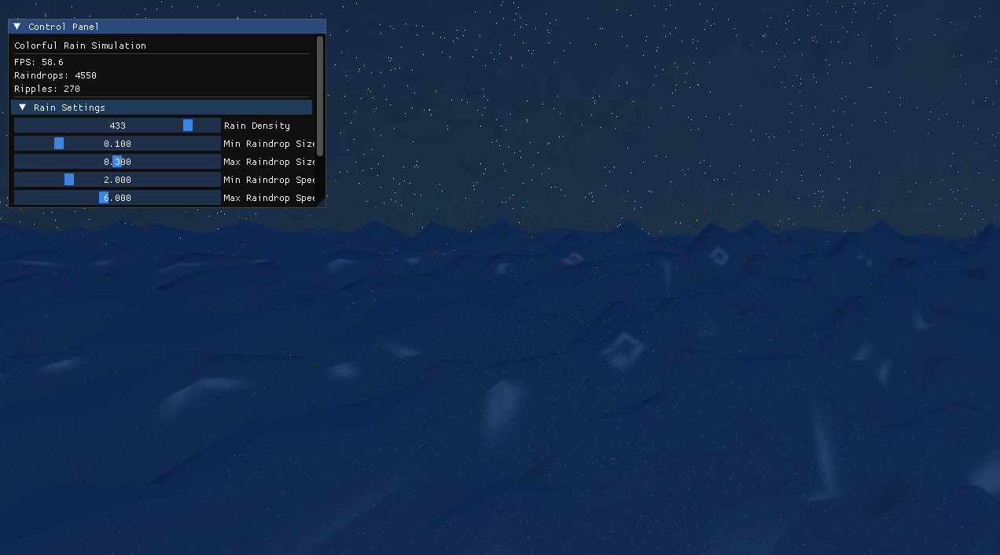

# Colorful Rain Simulation

A real-time OpenGL-based simulation of colorful raindrops falling onto a water surface at night. This application creates a serene night scene with a dynamic water surface, colorful rain, and beautiful ripple effects.



## Features

- Real-time water surface simulation with dynamic wave patterns
- Colorful raindrops with particle effects and trails
- Interactive ripple effects when raindrops hit the water
- Immersive night sky background with stars and moon
- Audio effects for raindrop splashes and ambient rain sounds
- Customizable parameters through a user-friendly interface
- Smooth camera controls for exploring the scene

## System Requirements

- Windows, macOS, or Linux operating system
- Graphics card with OpenGL 3.3+ support
- 4GB RAM (minimum)
- 100MB disk space
- Audio output device (optional, for sound effects)

## Dependencies

The project requires the following libraries:

- **OpenGL** (3.3 or higher)
- **GLEW** (OpenGL Extension Wrangler Library)
- **GLFW3** (for window creation and input handling)
- **GLM** (OpenGL Mathematics)
- **SDL2** (Simple DirectMedia Layer, for audio)
- **SDL2_mixer** (for advanced audio capabilities)
- **ImGui** (for the user interface)
- **stb_image** (for texture loading)

## Building the Project

### Prerequisites

Ensure you have CMake (3.10 or higher) and a C++17 compatible compiler installed.

### Building with CMake

1. Clone the repository:
   ```bash
   git clone https://github.com/ChavapaWLF/NightRain2.git
   cd NightRain2
   ```

2. Create a build directory:
   ```bash
   mkdir build
   cd build
   ```

3. Configure and build the project:
   ```bash
   cmake ..
   ```

4. Compile:
   - On Windows with MinGW:
     ```bash
     mingw32-make
     ```
   - On Windows with MSVC:
     ```bash
     cmake --build . --config Release
     ```
   - On macOS/Linux:
     ```bash
     make
     ```

5. Run the application:
   ```bash
   ./ColorfulRainSimulation
   ```

### Required Resources

Before running, ensure the following directories exist with appropriate textures:

- `textures/waternormal.jpeg` (1024x1024 pixels)
- `textures/waterDuDv.jpg` (512x512 pixels)
- `textures/waterReflection.jpg` (1024x1024 pixels)
- `textures/raindrop_glow.png` (128x128 pixels, with alpha channel)
- `textures/night_sky.jpg` (2048x1024 pixels)

Optional audio files:
- `audio/raindrop_splash.wav`
- `audio/ambient_rain.mp3`
- `audio/water_ripple.wav`

## Project Structure

```
ColorfulRainSimulation/
├── include/                  # Header files
│   ├── GL/                   # OpenGL headers
│   ├── glm/                  # GLM library headers
│   ├── SDL2/                 # SDL2 headers
│   ├── imgui/                # ImGui library
│   └── stb/                  # stb_image library
├── lib/                      # Library files
├── shaders/                  # GLSL shader files
│   ├── water.vert            # Water vertex shader
│   ├── water.frag            # Water fragment shader
│   ├── raindrop.vert         # Raindrop vertex shader
│   ├── raindrop.frag         # Raindrop fragment shader
│   ├── ripple.vert           # Ripple vertex shader
│   └── ripple.frag           # Ripple fragment shader
├── textures/                 # Texture files
├── audio/                    # Audio files
├── main.cpp                  # Main application code
├── CMakeLists.txt            # CMake build script
├── filesystem_compat.h       # Filesystem compatibility layer
└── README.md                 # This file
```

## Controls

- **W/A/S/D**: Move camera forward/left/backward/right
- **Space**: Move camera up
- **Ctrl**: Move camera down
- **Arrow Keys**: Rotate camera view
- **ESC**: Exit application

## Parameter Adjustment

The application includes a control panel that allows you to adjust various parameters:

### Rain Settings
- **Rain Density**: Controls how many raindrops are generated
- **Min/Max Raindrop Size**: Adjusts the size range of raindrops
- **Min/Max Raindrop Speed**: Controls how fast raindrops fall
- **Raindrop Colors**: Customize the colors of raindrops

### Water Settings
- **Wave Strength**: Controls the intensity of water waves
- **Max Ripple Size**: Adjusts the maximum size of ripples
- **Ripple Rings**: Sets the number of concentric rings in each ripple
- **Update Interval**: Controls how frequently the simulation updates
- **Ripple Colors**: Customize the colors of water ripples

### Camera Settings
- **Camera Speed**: Adjusts how quickly the camera moves
- **Current position and direction** information is displayed

### Audio Settings
- **Enable Sound**: Toggle sound effects on/off
- **Master Volume**: Overall volume control
- **Raindrop Volume**: Volume of raindrop splash sounds
- **Ambient Rain Volume**: Volume of background rain
- **Ripple Volume**: Volume of ripple sound effects

## License

This project is licensed under the MIT License - see below for details:

```
MIT License

Copyright (c) 2025 [Your Name]

Permission is hereby granted, free of charge, to any person obtaining a copy
of this software and associated documentation files (the "Software"), to deal
in the Software without restriction, including without limitation the rights
to use, copy, modify, merge, publish, distribute, sublicense, and/or sell
copies of the Software, and to permit persons to whom the Software is
furnished to do so, subject to the following conditions:

The above copyright notice and this permission notice shall be included in all
copies or substantial portions of the Software.

THE SOFTWARE IS PROVIDED "AS IS", WITHOUT WARRANTY OF ANY KIND, EXPRESS OR
IMPLIED, INCLUDING BUT NOT LIMITED TO THE WARRANTIES OF MERCHANTABILITY,
FITNESS FOR A PARTICULAR PURPOSE AND NONINFRINGEMENT. IN NO EVENT SHALL THE
AUTHORS OR COPYRIGHT HOLDERS BE LIABLE FOR ANY CLAIM, DAMAGES OR OTHER
LIABILITY, WHETHER IN AN ACTION OF CONTRACT, TORT OR OTHERWISE, ARISING FROM,
OUT OF OR IN CONNECTION WITH THE SOFTWARE OR THE USE OR OTHER DEALINGS IN THE
SOFTWARE.
```

## Acknowledgements

- Special thanks to the developers of all the libraries used in this project
- Inspiration drawn from natural rain and water surface physics
- Thanks to everyone who contributed to testing and providing feedback
